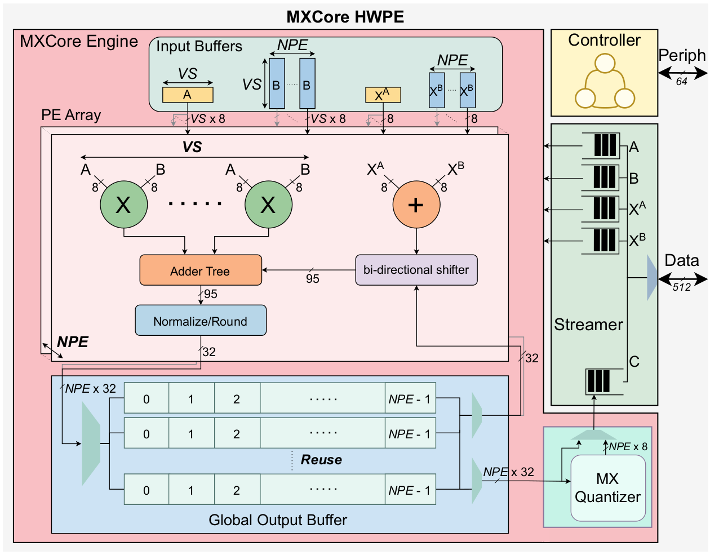

# MXCore - A Microscaling (MX) Matrix Multiplication Accelerator

Maintainer: Jayanth Jonnalagadda <jjonnalagadd@iis.ee.ethz.ch><br>
Maintainer: Gamze Islamoglu <gislamoglu@iis.ee.ethz.ch>

MXCore is a [HWPE](https://hwpe-doc.readthedocs.io/en/latest/index.html) matrix multiplication accelerator for [Microscaling (MX)](https://www.opencompute.org/documents/ocp-microscaling-formats-mx-v1-0-spec-final-pdf) data formats. MX formats group narrow (4-8 bit) elements into 32-element blocks sharing a common scaling factor, reducing memory footprint and computational cost. Proposed as an open standard by the Open Compute Project (2023) and backed by major industry vendors, these formats have been shown to achieve near full-precision accuracy on AI workloads [1], [2].

MXCore is a fully parametric accelerator framework built around an in-house MX dot product (MXDOTP) unit [3], designed to explore the accelerator-level design space across PE granularity (inner- and outer-product sizes), dataflow, and memory bandwidth. For further details, please refer to the [Publication](#publication) section.

## Features

- Fully parametric and configurable MX matrix multiplication accelerator.
- Supports instantiating processing-element arrays with configurable inner-product (`VectorSize`) and outer-product (`NPE`) sizes and output-buffer reuse depth (`Reuse`), delivering a peak throughput of `VectorSize × NPE` MACs/cycle.
- Includes an on-the-fly result quantizer that converts FP32 outputs into block-scaled MXFP8.

### Formats

| Role                  | Formats                               |
| --------------------- | -------------------------------------- |
| Source (operands)     | MXFP8 (E5M2), MXFP8ALT (E4M3), MXFP4   |
| Accumulation / Destination | FP32                              |
| Result quantization   | FP32 → MXFP8 (E5M2 or E4M3) in 32-element shared-exponent blocks, per the OCP MX specification |

## Hardware Architecture
MXCore is based on the HWPE template and consists of an engine, controller, and streamer. The MXCore Engine is the main compute subsystem of the accelerator, consisting of a parameterizable array of PEs, a shared global output buffer, and an MX quantizer.



| Category              | Supported                                     |
| ---------------------- | ---------------------------------------------- |
| Input formats (operands) | MXFP8 (E5M2), MXFP8ALT (E4M3), MXFP4        |
| Output quantization    | MXFP8 only (E5M2 or E4M3)                     |
| Accumulation           | FP32                                          |
| Tested 1K MAC configurations | (VS, NPE) ∈ {(32,32), (16,64), (8,128)}, Reuse ∈ {32,64,128} |

MXCore currently supports only regular tiles, i.e. GEMM shapes (`mdim`, `kdim`, `ndim`) that are multiples of the hardware configuration (`Reuse`, `VectorSize`, `NPE`); partial-tile support is yet to be merged.

## Repository Structure

* `mxcore-rtl/`: SystemVerilog sources, testbench, and Questa simulation flow for the MXCore HWPE.
* `PyGolden/`: Python golden model - bit-accurate reference for the MXCore datapath, and the test-vector generator (`tests.py`) and regression runner (`run_tests.py`).
* `testvectors/`: Generated GEMM test vectors (not committed - regenerate via `PyGolden.tests`). Split into `nopreload/` and `preload/`, matching the two accumulator-initialization modes the golden model supports.

## Getting Started

```bash
git clone https://github.com/pulp-platform/MXCore.git
```

### Test Vector Generation

Install the golden model's Python dependencies:
```bash
pip install mpmath numpy
```

Generate a GEMM test vector set:
```bash
python -m PyGolden.tests --memory_export --data_type FP8 --scale -63 63 --gemm_mdim 128 --gemm_kdim 128 --gemm_ndim 128 --mxdotp_vector_size 32 --num_mx_units 32 --num_out_buffers 64 --mx_block_size 32 --memory_data_width 32
```

This creates, under `testvectors/nopreload/` (or `testvectors/preload/` with `--preload`):
* `memory/`: Memory files with operand matrix data.
* `result/`: FP32 result matrix data.
* `result_mx/`: MX-quantized result matrix data.
* `data_header/`: C data header files for software integration.
* `debug/`: Dataflow and memory-layout debug dumps.

For more information on the available options, run:
```bash
python -m PyGolden.tests --help
```

### MXCore Simulation - QuestaSim

After generating test data, fetch the hardware dependencies and run the simulation:
```bash
make bender
make sim src_fmt=FP8 vector_size=32 num_compute_units=32 num_out_buffers=64 num_pipe_regs=4 tcdm_bw=512 mdim=128 kdim=128 ndim=128 no_stalls=1 prob_stall=0 quantize_mxfp8=1 block_size=32
```

A passing run prints `:) Passed with no mismatches! :)`.

### Regression Suite

`PyGolden/run_tests.py` generates the required test vectors and runs the full set of configurations in `mxcore-rtl/test_configs.json` through QuestaSim in parallel, printing a pass/fail summary:
```bash
python3 PyGolden/run_tests.py --tag ci
```

## References

[1] B. D. Rouhani et al., "OCP Microscaling Formats (MX) Specification," Open Compute Project, 2023. [link](https://www.opencompute.org/documents/ocp-microscaling-formats-mx-v1-0-spec-final-pdf)

[2] B. D. Rouhani et al., "Microscaling Data Formats for Deep Learning," arXiv:2310.10537, 2023. [link](https://arxiv.org/abs/2310.10537)

[3] G. İslamoğlu et al., "MXDOTP: A RISC-V ISA Extension for Enabling Microscaling (MX) Floating-Point Dot Products," IEEE 36th International Conference on Application-specific Systems, Architectures and Processors (ASAP), 2025. [link](https://arxiv.org/abs/2505.13159)

## Licensing

MXCore is an open-source project. Unless otherwise stated, hardware sources are licensed under the Solderpad Hardware License Version 0.51, and software sources under the Apache License Version 2.0.

## Publication

If you use MXCore in academic work, please cite: (TBA after ISVLSI 2026 conference proceedings are released)

```
MXCore: Rethinking Matrix Multiplication Accelerators for Microscaling (MX) Arithmetic
Gamze İslamoğlu*, Jayanth Jonnalagadda*, Arpan Suravi Prasad, Francesco Conti, Angelo Garofalo, Luca Benini
(* equal contribution)
```

## Acknowledgement
This work has received funding from the Swiss State Secretariat for Education, Research, and Innovation (SERI) under the SwissChips initiative.
